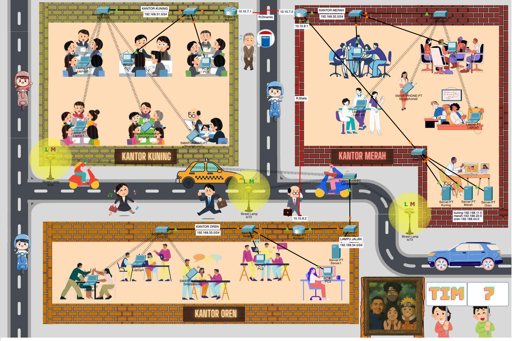

# 🌐 Topologi Jaringan Interkoneksi Kantor & IoT (TIM 7)

Proyek ini berisi rancangan dan konfigurasi simulasi topologi jaringan komputer terdistribusi menggunakan **Cisco Packet Tracer**. Jaringan ini menghubungkan tiga lokasi kantor utama, satu pusat data server (Data Center), serta infrastruktur penerangan jalan pintar berbasis Internet of Things (IoT).

---

## 📸 Topologi Jaringan




---

## 📌 Skema Subnetting & Pengalamatan IP

Berikut adalah rincian pembagian alamat IP (IP Addressing) pada masing-masing segmen LAN dan WAN:

### 🏢 1. Jaringan Lokal Kantor (LAN)

| Lokasi / Segmen | Network Subnet | Tipe Koneksi | Deskripsi Perangkat |
| :--- | :--- | :--- | :--- |
| **Kantor Kuning** | `192.168.31.0/24` | LAN / Wireless (AP) | PC, Laptop, Smartphone |
| **Kantor Merah** | `192.168.32.0/24` | LAN / Wireless (AP) | PC, Laptop, Smartphone |
| **Kantor Oren** | `192.168.33.0/24` | LAN / Wireless (AP) | PC, Laptop, Smartphone |
| **Lampu Jalan (IoT)** | `192.168.34.0/24` | IoT / Wireless | Street Lamp IoT & Server1 |

---

### 🖥️ 2. Pusat Data ( Dedicated Server Cluster)

| Server | Subnet Network | Deskripsi |
| :--- | :--- | :--- |
| **Server Kuning** | `192.168.11.0/24` | Dedicated Server untuk Kantor Kuning |
| **Server Merah** | `192.168.22.0/24` | Dedicated Server untuk Kantor Merah |
| **Server Oren** | `192.168.44.0/24` | Dedicated Server untuk Kantor Oren |

---

### 🌐 3. Jalur Antar Router (WAN) & Protocol Routing

| Antar Router | Segment IP / Point-to-Point | Metode Routing |
| :--- | :--- | :--- |
| **Router Kuning $\leftrightarrow$ Router Merah** | `10.10.7.0/30` (`10.10.7.1` - `10.10.7.2`) | **Routing Dinamis** *(RIP / OSPF)* |
| **Router Merah $\leftrightarrow$ Router Oren** | `10.10.8.0/30` (`10.10.8.1` - `10.10.8.2`) | **Routing Statis** |

---

## ⚙️ Fitur Utama Jaringan

* **Hybrid Routing:** Menggabungkan Routing Dinamis dan Routing Statis dalam satu skenario terintegrasi.
* **Smart City / IoT Integration:** Implementasi sistem penerangan jalan otomatis (*Street Lamp IoT*) yang terhubung ke server terpusat.
* **Dedicated Data Center:** Akses server khusus untuk tiap-tiap entitas kantor.
* **Wireless Access:** Penyediaan Access Point (AP) di setiap divisi kantor untuk memfasilitasi perangkat *mobile* (smartphone & laptop).

---

## 🚀 Cara Menjalankan Simulasi

1. Download dan install **Cisco Packet Tracer** (versi terbaru disarankan).
2. Clone repository ini atau unduh file `.pkt`:
   ```bash
   git clone [https://github.com/username/repository-topologi-tim7.git](https://github.com/username/repository-topologi-tim7.git)
